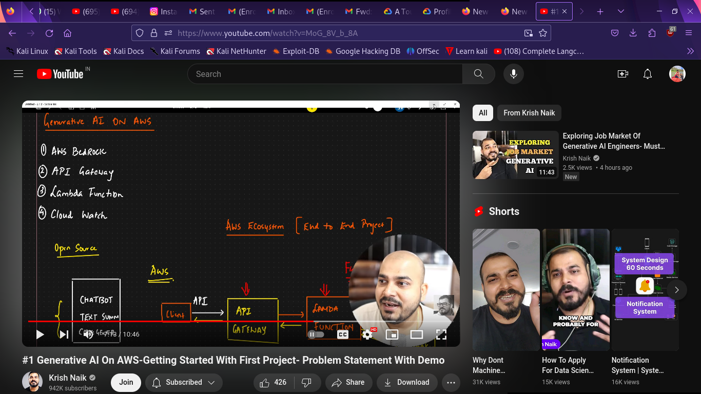
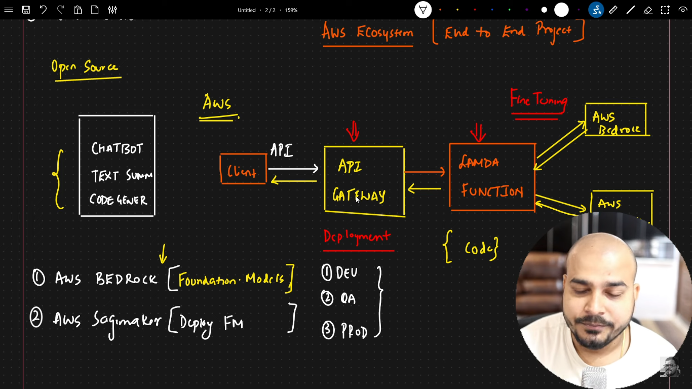

# Project: End-to-End Generative AI on AWS

Welcome to Project discuss where we delve into  project – an end-to-end Generative AI implementation on the AWS cloud. In this video, I explore the steps, services, and technologies involved in building and deploying a Generative AI project on AWS.

## Overview

In this section, we provide an overview of what viewers can expect from the video. Briefly discuss the project's goals, the services used, and the overall structure of the video.

## Services Utilized

In our project, we leverage several key AWS services to build and deploy our Generative AI model:

- **AWS Bedrock**: Describe the role of AWS Bedrock and how it facilitates the development and deployment of machine learning models on AWS.
- **Lambda Function**: Explain how Lambda functions are utilized within our project and their significance in handling model inference requests.
- **API Gateway**: Discuss the role of API Gateway in creating RESTful APIs to interact with our Generative AI model.
- **S3 Bucket**: Detail the usage of S3 buckets for storing model artifacts, datasets, and other project resources.

## Implementation Details

Provide insights into the implementation details of our Generative AI project:

- **Data Preprocessing**: Briefly discuss any data preprocessing steps required for our model.
- **Model Training**: Describe how the Generative AI model is trained, including the training data and techniques used.
- **Deployment**: Explain how the trained model is deployed on AWS using the aforementioned services.

## Demo

In this section, we showcase a demo of our end-to-end Generative AI project running on the AWS cloud. This could be a video demonstration, a walkthrough of the deployed application, or code snippets illustrating key components.

## Conclusion

Summarize the key points discussed in the video and highlight the significance of deploying Generative AI projects on AWS. Encourage viewers to explore further and provide resources for learning more about AWS and Generative AI.

---

Feel free to customize the content according to the specifics of your project and the details covered in your video discussion.

# GenAI_on_AWS
# GenAI_on_AWS
